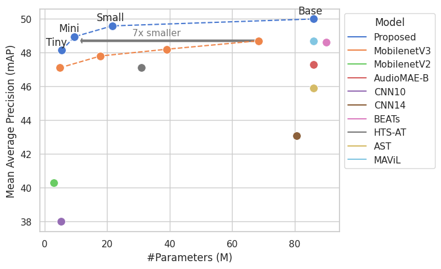

# Consistent Ensemble Distillation for Audio Tagging (CED)

This repo is the source for the Paper [Consistent Ensemble Distillation for Audio Tagging](https://arxiv.org/abs/2308.11957). 





| Model | Parameters | AS-20K | AS-2M |
|------|-------|-------|-------|
| CED-Tiny | 5.5   | 36.5  | 48.1  |
| CED-Mini | 9.6    | 38.5  | 49.0  |
| CED-Small| 22    | 41.6  | 49.6  |
| CED-Base | 86    | 44.0  | 50.0  |


* All models work with 16 kHz audio and use 64-dim Mel-spectrograms, making them very fast. `CED-Tiny` should be faster than MobileNets on a single x86 CPU (even though MACs/FLops would indicate otherwise).

Checkpoints are hosted on [Zenodo](https://zenodo.org/record/8275347):


| Model | Checkpoint 
|------|-------|
| CED-Tiny | [Link](https://zenodo.org/record/8275347/files/audiotransformer_tiny_mAP_4814.pt?download=1)| 
| CED-Mini | [Link](https://zenodo.org/record/8275347/files/audiotransformer_mini_mAP_4896.pt?download=1) |
| CED-Small| [Link](https://zenodo.org/record/8275319/files/audiotransformer_small_mAP_4958.pt?downloa) |
| CED-Base | [Link](https://zenodo.org/record/8275347/files/audiotransformer_base_mAP_4999.pt?download=1) |


## Inference/Usage


To just use the CED models for inference, simply run:

```
git clone https://github.com/Richermans/CED/
cd CED/
pip3 install -r requirements.txt
python3 inference.py resources/*
```


Note that I experienced some problems with higher versions of `hdf5`, so if possible please use `1.12.1`.

By default we use `CED-mini` here, which offers a good trade-off between performance and speed.
One can switch the models with the -m flag:

```bash
python3 inference.py -m ced_tiny resources/*
python3 inference.py -m ced_mini resources/*
python3 inference.py -m ced_small resources/*
python3 inference.py -m ced_base resources/*

```


## Training/Reproducing results


### 1. Preparing data


First, one needs to download Audioset. One might use one of our own [scripts](https://github.com/RicherMans/SAT/blob/main/datasets/audioset/1_download_audioset.sh).

For example, one can put the downloaded files into a folder named `data/balanced` and `data/unbalanced`, `data/eval` such as:

```
data/balanced/
├── -0DdlOuIFUI_50.000.wav
├── -0DLPzsiXXE_30.000.wav
├── -0FHUc78Gqo_30.000.wav
├── -0mjrMposBM_80.000.wav
├── -0O3e95y4gE_100.000.wav
…

data/unbalanced/
├── --04kMEQOAs_0.000_10.000.wav
├── --0aJtOMp2M_30.000_40.000.wav
├── --0AzKXCHj8_22.000_32.000.wav
├── --0B3G_C3qc_10.000_20.000.wav
├── --0bntG9i7E_30.000_40.000.wav
…

data/eval/
├── 007P6bFgRCU_10.000_20.000.wav
├── 00AGIhlv-w0_300.000_310.000.wav
├── 00FBAdjlF4g_30.000_40.000.wav
├── 00G2vNrTnCc_10.000_20.000.wav
├── 00KM53yZi2A_30.000_40.000.wav
├── 00XaUxjGuX8_170.000_180.000.wav
├── 0-2Onbywljo_380.000_390.000.wav

```

Then just generate a .tsv file with:

```
find data/balanced/ -type f | awk 'BEGIN{print "filename"}{print}' > data/balanced.tsv
```


Then dump the data as `hdf5` files using `scripts/wavlist_to_hdf5.py`:


```bash
python3 scripts/wavlist_to_hdf5.py data/balanced.tsv data/balanced_train/
```

This will generate a training datafile `data/balanced_train/labels/balanced.tsv`.


For the eval data, please use [this script](https://github.com/RicherMans/SAT/blob/main/datasets/audioset/1_download_audioset.sh) to download.

The resulting `eval.tsv` should look like this:

```
filename	labels	hdf5path
data/eval/--4gqARaEJE.wav	73;361;74;72	data/eval_data/hdf5/eval_0.h5
data/eval/--BfvyPmVMo.wav	419	data/eval_data/hdf5/eval_0.h5
data/eval/--U7joUcTCo.wav	47	data/eval_data/hdf5/eval_0.h5
data/eval/-0BIyqJj9ZU.wav	21;20;17	data/eval_data/hdf5/eval_0.h5
data/eval/-0Gj8-vB1q4.wav	273;268;137	data/eval_data/hdf5/eval_0.h5
data/eval/-0RWZT-miFs.wav	379;307	data/eval_data/hdf5/eval_0.h5
data/eval/-0YUDn-1yII.wav	268;137	data/eval_data/hdf5/eval_0.h5
data/eval/-0jeONf82dE.wav	87;137;89;0;72	data/eval_data/hdf5/eval_0.h5
data/eval/-0nqfRcnAYE.wav	364	data/eval_data/hdf5/eval_0.h5
```


### 2. Download logits

Download the logits used in the paper from [Zenodo](https://zenodo.org/record/8275347/files/logits.zip?download=1):

```bash
wget https://zenodo.org/record/8275347/files/logits.zip?download=1 -O logits.zip
unzip logits.zip
```

This will create:

```bash
logits/
└── ensemble5014
    ├── balanced
    │   └── chunk_10
    └── full
        └── chunk_10
```


### 3. Train


```bash
python3 run.py train trainconfig/balanced_mixup_tiny_T_ensemble5014_chunk10.yaml
```


## Training on your own data

This is a label-free framework, meaning that any data can be used for optimization.
To use your own data, do the follwing:

Put your data somewhere and generate a `.tsv` file with a single header `filename`, such as:

```bash
find some_directory -type f | awk 'BEGIN{print "filename"}{print}' > my_data.tsv
```

Then dump the corresponding hdf5 file using `scripts/wavlist_to_hdf5.py`:


```bash
python3 scripts/wavlist_to_hdf5.py my_data.tsv my_data_hdf5/
```

Then run the script `save_logits.py` as:

```bash
torchrun save_logits.py logitconfig/balanced_base_chunk10s_topk20.yaml --train_data my_data_hdf5/labels/my_data.tsv
```


Finally you can train your own model on that augmented dataset with:

```bash
python3 run.py train trainconfig/balanced_mixup_base_T_ensemble5014_chunk10.yaml --logitspath YOUR_LOGITS_PATH --train_data YOUR_TRAIN_DATA.tsv
```

